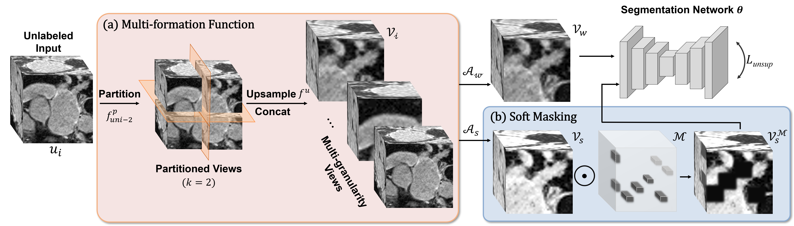

# MOST: Multi-Formation Soft Masking for Semi-Supervised Medical Image Segmentation

:pushpin: This is an official PyTorch implementation of **[MICCAI 2024]** - MOST: Multi-Formation Soft Masking for Semi-Supervised Medical Image Segmentation

> [**MOST: Multi-Formation Soft Masking for Semi-Supervised Medical Image Segmentation**]()<br>
> [Xinyu Liu](https://xinyuliu-jeffrey.github.io/), [Zhen Chen](https://franciszchen.github.io/), [Yixuan Yuan](http://www.ee.cuhk.edu.hk/~yxyuan/)<br>The Chinese Univerisity of Hong Kong, CAS-CAIR

We propose MOST, a simple and effective method for semi-supervised medical image segmentation that jointly enhances the data variety and learns the contextual information to infer the ambiguous regions. It first adopts a multi-formation function via partitioning and upsampling, followed by a soft masking and is constrained to give invariant predictions as the original data.

<div align="center">
    
</div>

## News

**[2024.5]** :newspaper: Code and pre-trained models of MOST are released.

## Get Started

Here we provide setup, training, and evaluation scripts.

### Installation

Prepare the conda environment for most with the following command:
```bash
conda create -n most python=3.11
conda activate most
pip install -r requirements.txt
```

### Data preparation

LA: Download from [LA data](https://github.com/yulequan/UA-MT/tree/master/data).

Pancreas: Download from [Pancreas](https://wiki.cancerimagingarchive.net/display/Public/Pancreas-CT) and preprocess following [here](https://github.com/grant-jpg/FUSSNet).

ACDC: Download from [ACDC](https://github.com/HiLab-git/SSL4MIS/tree/master/data/ACDC).

After preprocessing, make your data in the following structure:
```
datasets/
├── acdc/
│   ├── data/
│   │   ├── patient001_frame01.h5
│   │   ├── ...
│   │   └── slices/
│   │       ├── patient001_frame01_slice_1.h5
│   │       └── ...
│   ├── test.list
│   ├── train.list
│   ├── train_slices.list
│   ├── val.list
│   └── valtest.list
├── la/
│   ├── 2018LA_Seg_Training Set/
│   │   ├── 0RZDK210BSMWAA6467LU/
│   │   │   └── mri_norm2.h5
│   │   └── ...
│   ├── test.list
│   ├── train.list
│   ├── train_lab16.list
│   ├── train_lab4.list
│   ├── train_lab8.list
│   ├── train_unlab16.list
│   ├── train_unlab4.list
│   └── train_unlab8.list
└── pancreas/
    ├── data/
    │   ├── data0001.h5
    │   └── ...
    ├── test.list
    ├── train.list
    ├── train_lab12.list
    ├── train_lab6.list
    ├── train_unlab12.list
    └── train_unlab6.list
```

### Training

You can train MOST easily by specifying the GPU id, experiment name, seed, number of labeled data, and root data path. For example, on **LA** dataset with **8** labeled data:
```bash
python code/train_LA_MOST.py --gpu 0 --exp seed1337_mask16_mf --seed 1337 --labelnum 8
```

The trained model and logs will be saved to ```LA_seed1337_mask16_mf_VNet_pure_bs4_labbs2_8labeled_mratio0.75```

### Testing

You can test MOST by the following command. For example, to test a trained model on **LA**:
```bash
python code/test_LA_MOST.py --exp ./LA_seed1337_mask16_mf_VNet_pure_bs4_labbs2_8labeled_mratio0.75
```

## Citation

If you find our project is helpful, please feel free to leave a star and cite our paper:
```BibTeX
@InProceedings{liu2024most,
    title     = {MOST: Multi-Formation Soft Masking for Semi-Supervised Medical Image Segmentation},
    author    = {Liu, Xinyu and Chen, Zhen and Yuan, Yixuan},
    booktitle = {International Conference on Medical Image Computing and Computer-Assisted Intervention},
    year      = {2024},
}
```

## Acknowledgement

We sincerely appreciate [SSL4MIS](https://github.com/HiLab-git/SSL4MIS), [BCP](https://github.com/DeepMed-Lab-ECNU/BCP), [FUSSNet](https://github.com/grant-jpg/FUSSNet), [IDC](https://github.com/snu-mllab/Efficient-Dataset-Condensation), [MIC](https://github.com/lhoyer/MIC), and [volumentations](https://github.com/ZFTurbo/volumentations) for their awesome codebases. If you have any questions, contact xinyuliu@link.cuhk.edu.hk or open an issue.

## License

- [License](./LICENSE)
